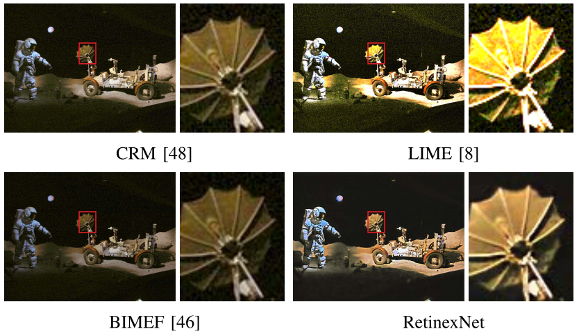

## Sparse Gradient Regularized Deep Retinex Network for Robust Low-Light Image Enhancement (TIP'2021)

[Wenhan Yang](https://flyywh.github.io/index.html), 
[Wenjing Wang](https://daooshee.github.io/website/), 
[Haofeng Huang](https://huangerbai.github.io/), 
[Shiqi Wang](https://www.cs.cityu.edu.hk/~shiqwang/), 
and [Jiaying Liu](http://www.icst.pku.edu.cn/struct/people/liujiaying.html) 

[[Paper Link]](http://39.96.165.147/Pub%20Files/2021/ywh_tip21_2.pdf)
[[Project Page]](https://github.com/flyywh/TIP-2021-Deep-Recursive-Band-Network)

### Abstract

Due to the absence of a desirable objective for lowlight image enhancement, previous data-driven methods may provide undesirable enhanced results including amplified noise, degraded contrast and biased colors. In this work, inspired by Retinex theory, we design an end-to-end signal prior-guided layer separation and data-driven mapping network with layer-specified constraints for single-image low-light enhancement. A Sparse Gradient Minimization sub-Network (SGM-Net) is constructed to remove the low-amplitude structures and preserve major edge information, which facilitates extracting paired illumination maps of low/normal-light images. After the learned decomposition, two sub-networks (Enhance-Net and Restore-Net) are utilized to predict the enhanced illumination and reflectance maps, respectively, which helps stretch the contrast of the illumination map and remove intensive noise in the reflectance map. The effects of all these configured constraints, including the signal structure regularization and losses, combine together reciprocally, which leads to good reconstruction results in overall visual quality. The evaluation on both synthetic and real images, particularly on those containing intensive noise, compression artifacts and their interleaved artifacts, shows the effectiveness of our novel models, which significantly outperforms the state-of-the-art methods.

#### If you find the resource useful, please cite the following :- )

```
@ARTICLE{Yang_2021_TIP_SGM,
  author={Yang, Wenhan and Wang, Wenjing and Huang, Haofeng and Wang, Shiqi and Liu, Jiaying},
  journal={IEEE Transactions on Image Processing}, 
  title={Sparse Gradient Regularized Deep Retinex Network for Robust Low-Light Image Enhancement}, 
  year={2021},
  volume={30},
  number={},
  pages={2072-2086},
  doi={10.1109/TIP.2021.3050850}}
```
 

## Installation

1. Clone this repo
2. Install PyTorch and dependencies from http://pytorch.org 
（**Note**: the code is suitable for PyTorch 0.4.1 or 0.4.0, If you have to use more advanced versions, which might be constrained to the GPU device types, you might access Wang Hong's github for the idea to replace parts of the dataloader: [[New Dataloader]](https://github.com/hongwang01/RCDNet/tree/master/pytorch1.0%2B/for_syn/src))

## Results
1. Real captured subset of LOL [[Baiduyun (65ay)]](https://pan.baidu.com/s/1pQW7zq4yqU1zMRrlotxkXg) [[Dropbox]](https://www.dropbox.com/s/yy0p5rkcjroqrvg/SGM-Cap-Results.zip?dl=0)
2. Synthetic subset of LOL [[Baiduyun (b14u)]](https://pan.baidu.com/s/1t5OYgDgk3mQO53OXqW7QEA) [[Dropbox]](https://www.dropbox.com/s/sw5rcm6f4sw5ozs/SGM-Syn-Results.zip?dl=0)

## Run the program
1. Reproduce the results in Table II and III of [[the original paper]](http://39.96.165.147/Pub%20Files/2021/ywh_tip21_2.pdf):

sh ./src/test_syn.sh

sh ./src/test_cap.sh


2. To deal real noisy/less-noisy low-light images: 

sh ./src/test_real_noisy.sh

sh ./src/test_real_noise_free.sh


## Contact

If you have questions, you can contact `yangwenhan@pku.edu.cn`.
A timely response is promised, if the email is sent by your affliaton email with your signed name.
